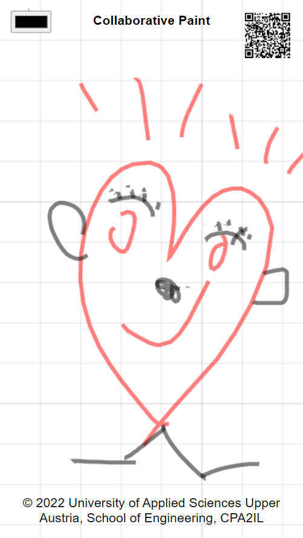
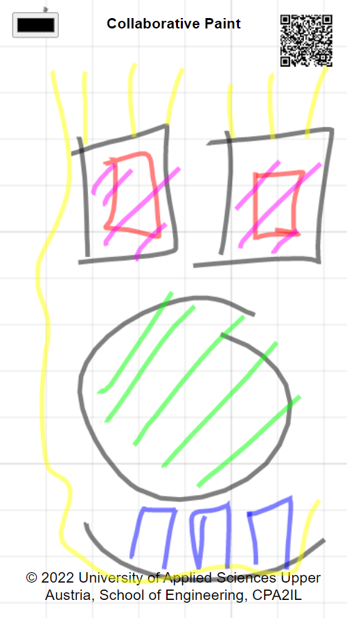
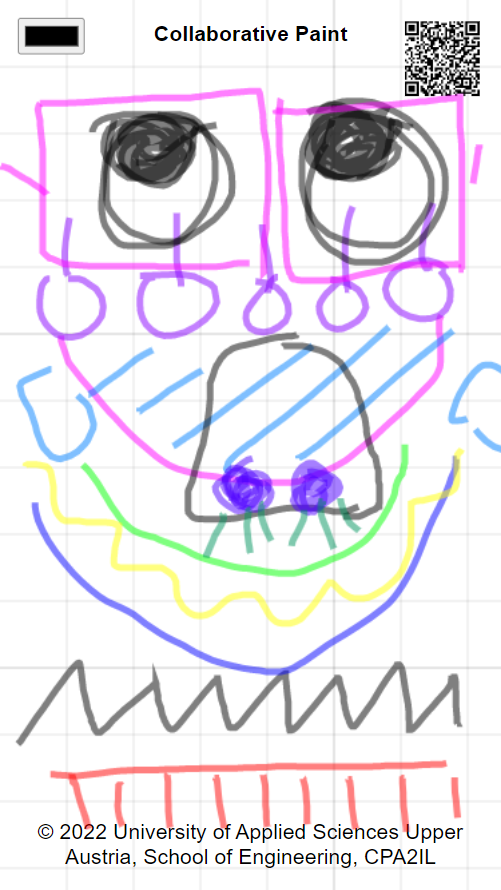

#  PaintWall

This project contains a collaborative paint application. The application is implemented as progressive web application (PWA). We use this project to teach cross-platform application develoment at [University of Applied Sciences Upper Austria](https://www.fh-ooe.at/).

## Demos

* [Demo-1 painting](https://iot.fh-wels.at/#paint/demo-1)
* [Demo-2 painting](https://iot.fh-wels.at/#paint/demo-2)
* [Demo-3 painting](https://iot.fh-wels.at/#paint/demo-3)

## Screenshots

  

## Packages

### Libraries

* *Coming soon*

### Executables

* A [backend executable](./packages/backend/) running on a **server**
* A [frontend executable](./packages/frontend/) running in a **browser**

## Dependencies

* Node.js

## Guides

### User guide

*Coming soon*

### Administrator guide

**Step 1**: Install dependencies.

```
cd packages/backend
npm install
```

**Step 2**: Start production mode.

```
cd packages/backend
npm start
```

### Developer guide

**Step 1**: Install dependencies.

```
cd packages/backend
npm install
```

**Step 2**: Start development mode.

```
cd packages/backend
npm run dev
```

