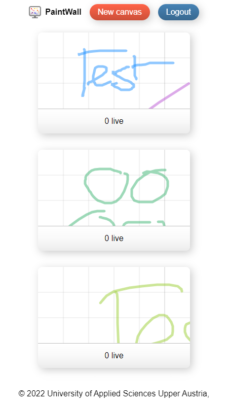
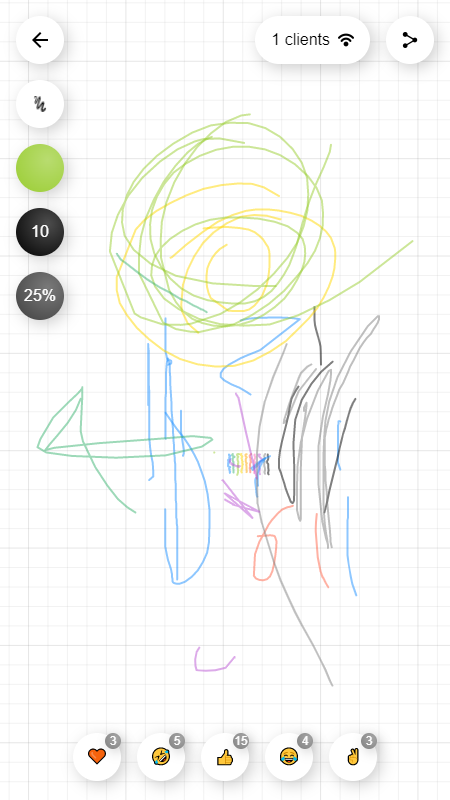
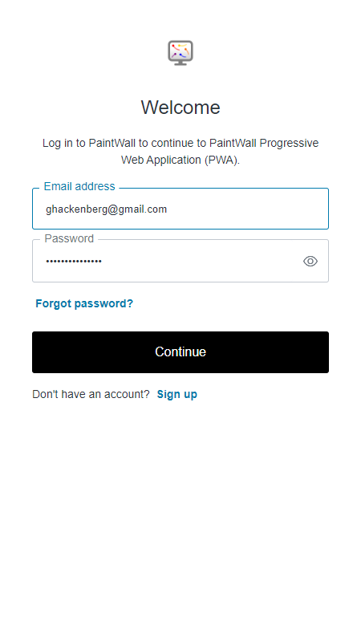
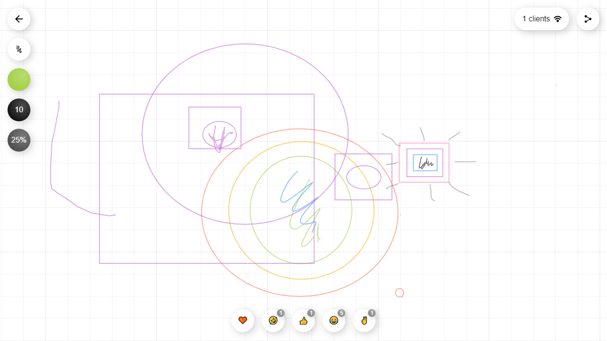
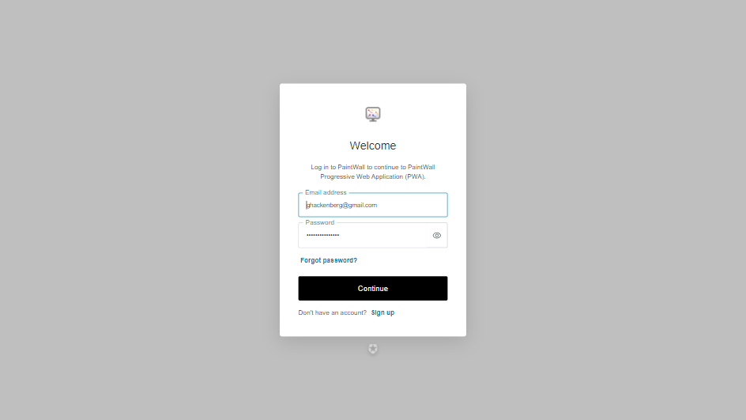

# PaintWall

This project contains a collaborative paint application. The application is implemented as progressive web application (PWA). We use this project to teach cross-platform application develoment at [University of Applied Sciences Upper Austria](https://www.fh-ooe.at/).

## Instances

* https://iot.fh-wels.at/paintwall/

## Resources

* [Guides](./guides/)
* [Graphics](./graphics/)
* [Screenshots](./screenshots/)
* [Packages](./packages/)

## Screenshots

### Phone

### Tablet

#### 7-Inch

### 10-Inch

